# Yandex Cloud: Ansible and Terraform Practice

## Что нужно заранее установить и сделать
- [Terraform](https://hashicorp-releases.yandexcloud.net/terraform/)
- [Ansible](https://docs.ansible.com/projects/ansible/latest/installation_guide/intro_installation.html)
- [Yandex Cloud CLI](https://yandex.cloud/ru/docs/cli/quickstart)

*Примечание*
_______________

**1. Возможные проблемы установки Ansible на Windows**
- Если Вам не поможет гайд [Ansible](https://docs.ansible.com/projects/ansible/latest/installation_guide/intro_installation.html), то воспользуйтесь следующим гайдом [Installing Ansible using Ubuntu in Windows 10](https://dockerhosting.ru/blog/kak-ustanovit-ansible-v-windows/). **Проверено на Windows 11**

**2. Установка WSL и получение ssh ключей**

 - В зависимости от среды разработки, в моем случае, **Visual Studio Code**: нужно установить расширение WSL

   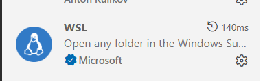

**3. Подключение WSL**

 - Далее нижнем левом углу находим следующий значок: 
 
    

 - Далее нажимаем на "**Connect to WSL**":
 
    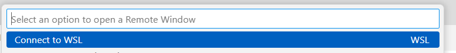

    ***Примечание:***
    _______
    Если выдаст ошибку при подключении к WSL, то следует проверить как дистрибутивы установлены. Для этого введите команду:

    ```
    wsl --list
    ```
    
    Возможно, у Вас выйдут несколько дистрибутивов (например, у меня вышло два: **docker-desktop** (по умолчанию) и **Ubuntu**):

    В этом случае есть два варианта:
    
      1. Также перейти по вкладку "**Connect to WSL**", но нажать на "**Connect to WSL using Distro**":

    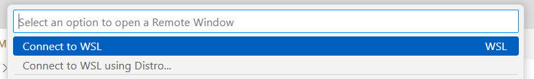

      Далее следует нужный дистрибутив, в нашем случае, **Ubuntu**.
      
    Если нет, то установите Ubuntu:
    ```
     wsl --install -d Ubuntu
    ```
      2. Второй вариант лучше. Сделаем Ubuntu дистрибутивом по умолчанию:

      ```
      wsl --set-default Ubuntu
      ```

   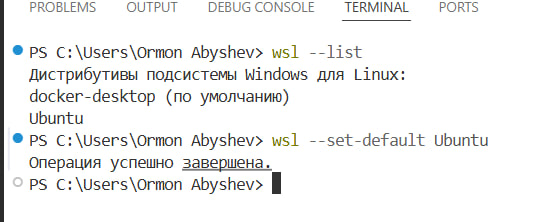

 - После этого нажимаем сочетание клавиш "**Ctrl+Shift+~**". Откроется терминал и вводим следующую команду:
    
    ```
    ssh-keygen -t ed25519
    ```

    Далее нажимаем три раза **Enter** и создадутся ключи:
    
    ```
    ~/.ssh/id_ed25519
    ~/.ssh/id_ed25519.pub
    ```
    Публичный ключ нужно будет скопировать в папку terraform:

    ```
    cp ~/.ssh/id_ed25519.pub /mnt/диск/Ваша_рабочая_директория
    ```

    Проверьте файл id_25519.pub в папке terraform/

## Шаг 1. Получение IAM - токена, cloud_id и folder_id 

Войдите в Yandex Cloud CLI (**далее - YC CLI**) и получите IAM - токен (***время его жизни не более 12 часов!!!***)

```
yc iam create-token
```

Вы получите (пример взят из источника [3]): 

```
t1.9euelZrLop7Uz8up********
```

Далее следует вести следующую команду в YC CLI, чтобы узнать **cloud_id** и **folder_id**:

```
yc config list
```
Вывод (взято из источника [1]):

```
subject-id: b1g159pa15cd********
username: <электронная_почта>
folder-id: b1g8o9jbt58********
compute-default-zone: ru-central1-b
```
Источники: 
1. [Yandex Cloud CLI](https://yandex.cloud/ru/docs/cli/quickstart)
2. [IAM-токен](https://yandex.cloud/ru/docs/iam/concepts/authorization/iam-token)
3. [Получение IAM-токена для аккаунта на Яндексе](https://yandex.cloud/ru/docs/iam/operations/iam-token/create)

## Шаг 2. Настройка переменных окружения Terraform

Перейдите в папку terraform и создайте файл с переменными окружения:

```
cd terraform
cp terraform.tfvars.example terraform.tfvars
```
Откройте файл terrafom.tfvars и добавьте свои данные:

```
 yc_token = "Ваш IAM - токен"
 yc_cloud_id = "Ваш cloud_id"
 yc_folder_id = "Ваш folder_id"
```

#### ВАЖНО!!! Файл **terraform.tfvars** должен быть добавлен в **.gitignore**

## Шаг 3. Поднять инфраструктуру через Terraform

Находясь в папке **terraform/**:

Инициализируем рабочий каталог Terraform:
```
terraform init
```

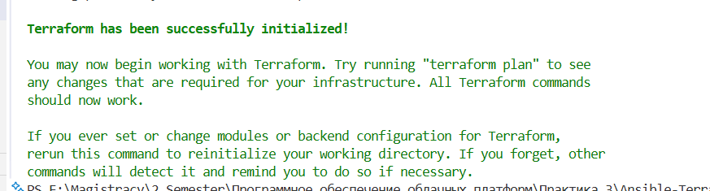

Перед созданием, посмотрим, что будет создано (предварительно):

```
terraform plan
```

Если возникло ошибок, то создаем:

```
terraform apply
```

Terraform попросит подтверждение, нужно вести "**yes**"

После завершения Вы увидите в терминале публичныые IP - адреса всех трех VM и ссылку на Grafana:

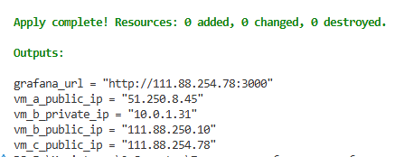

Также после завершения создастся файл "ansible/inventory.ini" с IP - адресами всех VM
_______

4. [Основные команды Terraform](https://cloud.vk.com/docs/tools-for-using-services/terraform/reference/commands)


## Шаг 4. Ansible

Нужно подождать 1 мин, пока загрузятся все VM. Затем подключитесь в WSL, перейдите в папку ansible/ и запустите playbook:

```
cd .../ansible

ansible-playbook -i inventory site.yml
```

Ansible запустит в следующем порядке:
  1. Установит Docker на все три VM;
  2. Запустит MQTT Broker на VM_B;
  3. Запустит симуляторы сенсоров на VM_A;
  4. Запустит InfluxDB, Telegraf и Grafana на VM_C

Это займет около 2-5 минут.

## Шаг 5. Проверить результаты:

Откройте браузер и передийте по адресу **Grafana**:

```
http://<IP_VM_C>:3000
```

- login: ***admin***
- password: ***admin***

В разделе **Connections** выберите **Data sources**

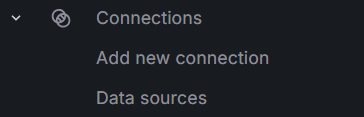

Внизу страницы будет **InfluxDB Details:**

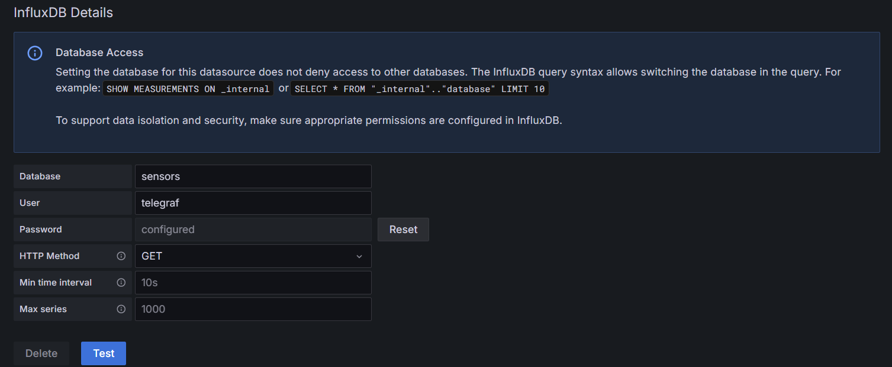

Нажмите кнопку **Test**

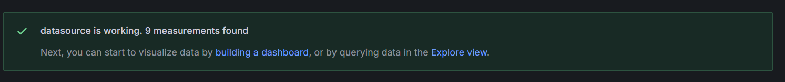

После этого перейдите по ссылке **Explore view**. В поле FROM выберите mqtt_consumer:

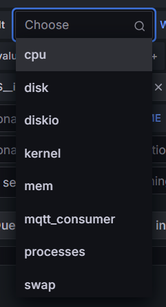

Снизу появятся значения: 

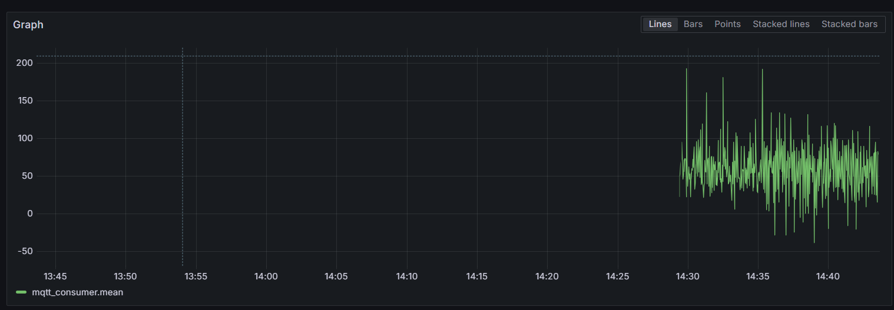


Если результаты появились, нужно вернуться во вкладку **Dashboards**. Выбрать вкладку "**Docker Practice**". В каждой панели нужно выбрать в поле FROM: mqtt_consumer. После этого сохраняем выбор, должны появиться значения.  

### Результаты:
________

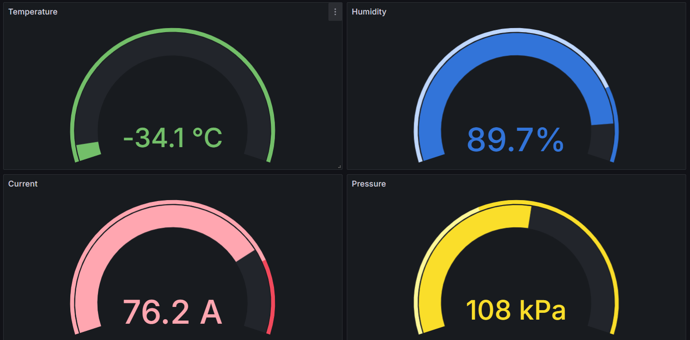

## Как удалить всю инфраструктуру:

Когда работа будет завершена, нужно удалить все VM одной командой:

```
cd terraform
terraform destroy
```

Потребуется подтверждение "**yes**". Все созданные ресурсы будут удалены.


# ВАЖНО!!! Все чувствительные файлы должны быть добавлены в **.gitignore**

